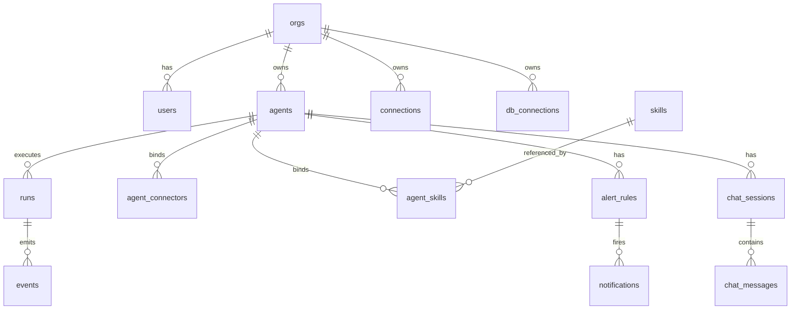
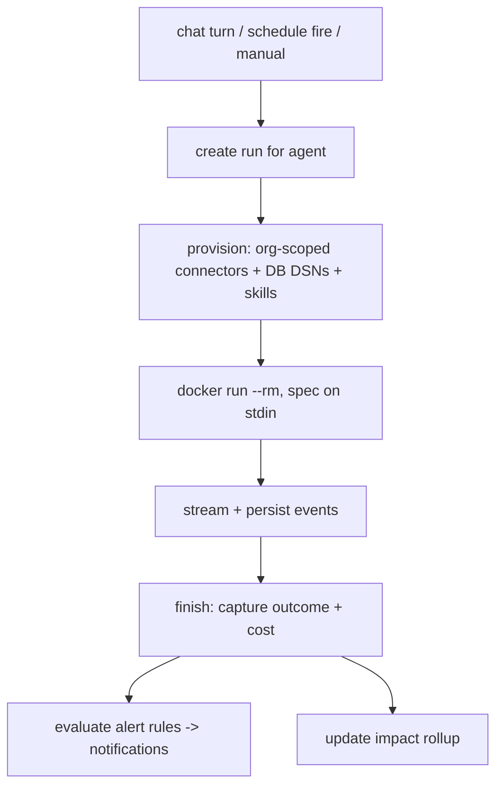

# Agent Builder - Plan

> **Product Contract preservation:** unchanged. Planning enriches this file in place; all R-IDs and product scope are carried verbatim from the brainstorm.

## Goal Capsule

- **Objective:** Ship a hosted, multi-tenant Agent Builder MVP that lets a few design users build an agent, run a real recurring job end-to-end, and see quantified time/cost saved.
- **Authority:** Product Contract (below) is the source of truth for *what*; this plan owns *how*. Founder (Shubham) is the decision authority for scope changes.
- **Execution profile:** Enrich the existing FastAPI + SQLite + Docker-runner codebase; do not rewrite it. Build the MVP slice (U1–U9) first; fast-follow items stay deferred.
- **Stop conditions:** Stop and surface if a change would break tenant isolation, if the task→agent migration would lose existing run history, or if DB-credential encryption cannot be done at rest.
- **Open blockers:** None. OQ1 (differentiator) deferred to design-user signal; OQ2 (alerts) resolved to in-app; OQ3/OQ4 resolved in the Planning Contract below.

---

## Product Contract

### Summary

A hosted, multi-tenant Agent Builder. A user signs up into an org, composes a reusable **agent** from connectors (SaaS + databases) and SDK-native skills, then chats with it, schedules it, and gets alerts. It ships with at least one prebuilt template agent and built-in impact tracking, so the first design users can run a real recurring job and see both that it ran end-to-end and the time/cost it saved.

### Problem Frame

Antonagents today is a one-shot task runner: submit a prompt, get an isolated run. That shape can't be sold as a product a user returns to — there is no persistent thing to configure, converse with, or measure over time. The near-term goal is to onboard a handful of users, prove value on a real recurring workflow, then expand. Proving value requires a persistent agent the user builds once and reuses, and an impact number to point at.

### Key Decisions (product)

- **Platform-first, not vertical-first.** v1 is the general builder; it must ship at least one prebuilt template agent and impact tracking so design users reach measurable value without building from scratch.
- **Hosted multi-tenant, not self-hosted.** Chosen for speed to users; customer tokens and data live in the product cloud, and the sovereignty wedge is dropped for v1.
- **Skill = SDK-native packaged capability.** Reuses the Claude Agent SDK skills mechanism (instructions + optional scripts/resources), low-build and user-authorable.
- **Agent is the core object; a run is its execution.** The former standalone "task" folds into "an agent and its runs" (chat turn, scheduled fire, or manual trigger).
- **The wedge is deliberately deferred.** v1 ships without a locked differentiator; the bet is to discover it through design-user usage (OQ1).

### Actors

- A1. **Org admin** — creates/administers the org, manages members and org-level connections.
- A2. **Builder (member)** — creates agents, connects accounts, chats, schedules, sets alerts.
- A3. **The agent** — executes each run in an isolated container, acting as the user across its connectors.
- A4. **External systems** — SaaS apps via the connector layer, and databases the agent reads (or writes).

### Requirements

**Accounts & tenancy**
- R1. A person can sign up and create or join an **org**. One deployment hosts many orgs, each isolated so no org can see another's data, agents, connections, or runs.
- R2. Within an org, users have roles (at least admin and member); admins manage membership and org-level connections.

**Agent**
- R3. A user can create an **agent**: a persistent, named configuration of model/provider, system prompt, selected connectors, and attached skills.
- R4. The agent is the unit of interaction; every execution is a **run** of it (chat turn, scheduled fire, or manual trigger), streamed live and recorded.
- R5. The product ships with at least one **prebuilt template agent** (connectors and skills preconfigured) so a new user can run a real job on day one.

**Connectors**
- R6. A user can connect SaaS accounts through the managed connector layer and choose which connected tools an agent may use; the agent acts as the connecting user, scoped to granted permissions.
- R7. Native **database connectors** for PostgreSQL, MySQL, and MongoDB: a user adds a connection whose credentials are stored **encrypted at rest** (never in plaintext run env), selects it for an agent, and the agent can query it. Connections default to **read-only**, with read-write as an explicit opt-in.

**Skills**
- R8. A **skill** is a packaged capability (instructions plus optional scripts/resources) following the Agent SDK skills mechanism. Skills can be attached to an agent and authored or added by users.

**Interaction & automation**
- R9. A user can **chat** with an agent in a multi-turn conversation that retains memory and workspace across turns.
- R10. A user can put an agent on a **routine** (one-shot, interval, or cron); each fire is a run.
- R11. A user can configure **alerts** on an agent that fire on run failure, an agent-flagged result condition, or a missed scheduled run, delivered **in-app** for v1. External channels (email, Slack, webhook) are deferred.

**Impact**
- R12. The product captures a per-agent, per-org **impact view**: whether each run completed end-to-end, and the time/cost saved versus a baseline — so a user can point to a concrete number.

### Key Flows

- F1. **Build an agent.** New agent → pick model → select connectors (SaaS + DB) → attach skills → save.
- F2. **Chat.** Open agent → send message → run executes (streamed) → reply; memory and workspace persist across turns.
- F3. **Schedule.** Set a routine on an agent → each fire creates a run → results recorded → impact view updated.
- F4. **Alert.** A trigger condition fires on a run or schedule → an in-app notification is delivered.
- F5. **Connect.** Initiate SaaS OAuth, or enter DB credentials → stored (SaaS via connector platform; DB encrypted) → available to select for any of the user's agents.

### Acceptance Examples

- AE1. **Covers R1.** Given orgs Acme and Beta on the same deployment, when a Beta user lists agents, connections, and runs, then only Beta's appear and no Acme identifier is reachable by id.
- AE2. **Covers R7.** Given a Postgres connection added as read-only, when the agent attempts a write, then the write is refused; when the same connection is re-added with read-write opted in, the write succeeds.
- AE3. **Covers R12.** Given an agent that has run a scheduled job for a week, when the user opens its impact view, then it shows runs completed end-to-end and an aggregate time/cost saved versus the recorded baseline.

### Success Criteria

- **Value-proven signal (dual, both required):** (a) an agent completes a real recurring job end-to-end, unattended and correctly, that the user would otherwise pay a person to do; and (b) the impact view shows quantified time/cost saved versus the manual baseline for that job.
- A handful of design users onboard and reach that signal on their own workflow, largely self-serve.

### Scope Boundaries

**Deferred for later** (product-level)
- Self-hosted / sovereign deployment — an upmarket move after hosted traction.
- Billing / subscription mechanics.
- A fixed vertical baked into the product — the product stays general; the first concrete use case is discovered with design users.

**Deferred to Follow-Up Work** (plan-local, post-MVP)
- ClickHouse DB connector (needs a new client in the image).
- User-authored skills UI (MVP ships prebuilt skills only).
- Org roles/admin and full org management (MVP auto-creates one org per signup).
- External alert channels (email, Slack, webhook) — MVP is in-app only.
- Host-side MCP proxy to remove the Composio org-key from task containers (see KTD8).

Dropping self-hosting for v1 means the product does **not** differentiate on sovereignty yet — a conscious positioning gap tracked in OQ1.

### Outstanding Questions

**Deferred — revisit after design-user signal**
- OQ1. The durable differentiator versus Lindy and incumbents is intentionally deferred: decide once design users reveal what actually sticks. The top product risk, not a build blocker.

---

## Planning Contract

### Key Technical Decisions

- KTD1. **Agent supersedes Task (OQ4).** Introduce an `agents` table as the persistent config. `runs` gain `agent_id`. Existing `tasks` migrate 1:1 to `agents` and their runs repoint; the `tasks` table and its endpoints are removed (no alias) — the dataset is tiny and pre-launch. Rationale: a clean model is cheaper to maintain than a compatibility shim nobody needs.
- KTD2. **Org-scoped multi-tenancy (OQ3).** Add an `orgs` table and an `org_id` foreign key on every tenant-owned row (users, agents, connections, db_connections, runs-via-agent, alerts, chat). Every query is scoped by the authenticated user's `org_id` through a `get_owned_*`-style helper (mirrors the existing `get_owned_task` pattern). One org is auto-created per signup; invites and roles are deferred. Isolation is enforced at the DB-helper layer, not per-endpoint, so a missed scope can't silently leak.
- KTD3. **DB connectors are a native driver behind the existing `Connector` interface.** A new `db` driver stores the connection DSN **encrypted at rest** (symmetric key from a new `SUPERAGENT_SECRET_KEY` env var) in a `db_connections` table — never in `tasks.env_json`. At run launch the DSN is decrypted and injected via the container **stdin spec** (not argv, not persisted), consistent with how provider keys already flow. The agent queries via the CLI clients in the image (`psql`, `mysql`, `mongosh`). Read-only is the default and is enforced by connecting with a read-only credential/flag where the engine supports it, plus an explicit agent instruction; read-write is an opt-in per connection.
- KTD4. **Skills materialize into the container at launch.** Skills are stored as files (a `SKILL.md` plus optional resources) in a per-org skills store; an agent references the skill ids it uses. At launch the runner writes the selected skills into the container's skills directory so the Agent SDK loads them. MVP ships a small set of prebuilt skills bundled with the image/template; user authoring is deferred.
- KTD5. **Impact = baseline × outcome, computed from runs.** Each agent carries a user-entered **baseline** (manual minutes per run) and an org hourly rate. Impact aggregates over the agent's runs: runs that reached a non-error `result` + `done` count as completed end-to-end; time saved = completed_runs × baseline_minutes; cost saved = time saved × rate; agent spend = sum of `runs.cost_usd` (already captured). No new run-capture pipeline — it reads existing run/event records.
- KTD6. **Alerts evaluate on run finish; delivery is an in-app feed.** `alert_rules` bind to an agent (trigger ∈ run-failure / result-condition / schedule-miss). The runner evaluates rules when a run finishes and writes rows to a `notifications` table; the console shows an unread feed. Schedule-miss is evaluated by the scheduler. No external channels in MVP.
- KTD7. **Chat reuses the existing session-resume + per-agent volume.** A chat session is an ordered series of runs on one agent, each resuming the prior SDK session (the follow-up/`resume` machinery already exists). Persist `chat_sessions` and `chat_messages` for display; the per-task persistent volume becomes the per-agent workspace.
- KTD8. **Composio org-key debt is accepted for MVP (OQ3).** The per-user Composio MCP config still carries the org-wide key into the task container via stdin. For a few trusted design users this is acceptable, documented debt; the host-side MCP proxy that removes it is deferred (Scope Boundaries). Tracked as a Risk.

### High-Level Technical Design

Data model after the task→agent migration and org scoping:

Run lifecycle (unchanged execution core; new provisioning inputs):

### Assumptions

- Existing auth (`app/auth.py`), the connector interface (`app/connectors/`), the scheduler (`app/scheduler.py`), and the Docker runner with SSE + session-resume (`app/runner.py`) are reused, not rewritten.
- SQLite remains the store for MVP; multi-tenancy is enforced logically via `org_id`, not physical DB-per-tenant.
- Read-only DB enforcement relies on engine-level read-only credentials where available; where not, it degrades to an agent instruction (documented in U4).

### Sequencing

MVP is U1 → U9, dependency-ordered. U1 (orgs/isolation) and U2 (agent entity + migration) are the foundation everything else builds on. U9 (template agent) lands last because it composes U3/U4/U8.

---

## Implementation Units

### U1. Orgs and tenant isolation
- **Goal:** Add `orgs`, auto-create one org per signup, and scope every tenant table + query by `org_id`.
- **Requirements:** R1, R2 (roles minimal).
- **Dependencies:** none.
- **Files:** `app/db.py` (add `orgs`; add `org_id` to `users` and all tenant tables; migrations via `_ensure_column`; `get_owned_*` helpers scope by org), `app/auth.py` (create org on register, attach to session user), `app/main.py` (thread `org_id` through endpoints).
- **Approach:** Mirror the existing `get_owned_task(task_id, owner_id)` pattern but scope by `org_id`. Enforce isolation in the DB helpers so endpoints can't forget.
- **Test scenarios:** Covers AE1. Two orgs; user in org B cannot GET/list/act on org A's rows (404). Signup auto-creates exactly one org and makes the user its admin. Existing single-user data migrates into a default org.
- **Verification:** Cross-org access returns 404; all existing endpoints still resolve for the owning org.

### U2. Agent entity + task→agent migration
- **Goal:** Introduce `agents`; repoint `runs` to `agent_id`; migrate existing tasks→agents; remove `tasks`.
- **Requirements:** R3, R4.
- **Dependencies:** U1.
- **Files:** `app/db.py` (`agents` table, `runs.agent_id`, one-time task→agent migration, drop `tasks`), `app/main.py` (agent CRUD endpoints replacing task endpoints), `app/runner.py` + `app/scheduler.py` (operate on agents), `web/index.html` (agent create/list UI replacing task UI).
- **Approach:** A run is created for an agent from chat/schedule/manual. Migration creates one agent per existing task and repoints its runs. Keep `runs`, `events` intact.
- **Execution note:** Write the migration with a characterization check first — snapshot existing task/run counts, migrate, assert run history is preserved.
- **Test scenarios:** Create agent; manual run of an agent produces a streamed run; migration maps N tasks to N agents with all runs repointed and zero orphaned runs.
- **Verification:** Existing runs still open and stream; no `tasks` references remain.

### U3. Agent config: connectors + skills binding
- **Goal:** Bind SaaS connectors (existing Composio layer) and skills to an agent; materialize skills into the container at launch.
- **Requirements:** R6, R8.
- **Dependencies:** U2.
- **Files:** `app/db.py` (`skills`, `agent_connectors`, `agent_skills`), `app/connectors/` (resolve an agent's bound connectors for provisioning), `app/runner.py` (write selected skills into the container skills dir; inject only the agent's connectors), `web/index.html` (connector + skill pickers in the agent builder).
- **Approach:** Skills stored as `SKILL.md` + resources per org; at launch, materialize the agent's skills into the SDK skills directory. Reuse the existing per-user connector provisioning, scoped to the agent's selection.
- **Test scenarios:** Agent with Slack + one skill launches with exactly those tools/skills available; an agent with no skills launches cleanly; skill files land in the expected container path.
- **Verification:** A run shows the agent using a bound skill and only bound connectors.

### U4. Native DB connectors (Postgres, MySQL, Mongo)
- **Goal:** DB driver behind the `Connector` interface; encrypted DSN storage; read-only default; inject at launch; add `mongosh` to the image.
- **Requirements:** R7.
- **Dependencies:** U1, U3.
- **Files:** `app/connectors/db_driver.py` (new), `app/connectors/__init__.py` (register), `app/db.py` (`db_connections` table + encryption helpers), `app/config.py` (`SUPERAGENT_SECRET_KEY`), `app/runner.py` (decrypt + inject DSN via stdin spec), `docker/Dockerfile.task` (install `mongosh`).
- **Approach:** DSN encrypted at rest with a symmetric key; decrypted only at launch and passed on stdin, never argv or `env_json`. Read-only default enforced via a read-only DSN/role where the engine supports it, plus an agent instruction; read-write is an explicit per-connection opt-in.
- **Execution note:** Rebuild the task image after the Dockerfile change (`mongosh`), same as the prior baked-in-file gotcha.
- **Test scenarios:** Covers AE2. Read-only Postgres refuses a write; read-write opt-in permits it. Mongo and MySQL connections list and query. Stored DSN is ciphertext at rest; the plaintext never appears in `events` or `env_json`.
- **Verification:** Agent queries each engine; a manual DB dump of `db_connections` shows only ciphertext.

### U5. Chat
- **Goal:** Interactive multi-turn chat with an agent, reusing session-resume and the per-agent volume.
- **Requirements:** R9.
- **Dependencies:** U2.
- **Files:** `app/db.py` (`chat_sessions`, `chat_messages`), `app/main.py` (chat send + history endpoints), `app/runner.py` (resume wiring already exists), `web/index.html` (chat panel).
- **Approach:** Each chat turn is a run that resumes the prior SDK session; persist messages for display. Reuse the follow-up/`resume` machinery already built.
- **Test scenarios:** Two-turn chat retains memory across turns; a file written in turn 1 is visible in turn 2 (persistent workspace); history renders in order.
- **Verification:** A follow-up turn recalls earlier context and reads an earlier-written workspace file.

### U6. Schedule routines on agents
- **Goal:** Wire the existing scheduler to agents; per-agent routine config + UI.
- **Requirements:** R10.
- **Dependencies:** U2.
- **Files:** `app/scheduler.py` (fire runs for agents), `app/main.py` (routine config endpoints), `web/index.html` (routine UI on the agent).
- **Test scenarios:** An interval routine fires a run automatically; disabling the routine stops fires; each fire is recorded as a run of the agent.
- **Verification:** A scheduled agent produces runs on cadence without manual triggering.

### U7. In-app alerts
- **Goal:** Alert rules per agent; evaluate on run finish / schedule miss; in-app notification feed.
- **Requirements:** R11.
- **Dependencies:** U2, U6 (schedule-miss trigger).
- **Files:** `app/db.py` (`alert_rules`, `notifications`), `app/runner.py` (evaluate run-failure / result-condition on finish), `app/scheduler.py` (schedule-miss), `app/main.py` (alerts CRUD + notifications feed), `web/index.html` (unread feed + badge).
- **Test scenarios:** A failing run creates a failure notification; a result-condition rule fires when the agent output matches; a missed scheduled run creates a miss notification; unread count reflects new notifications.
- **Verification:** Each trigger produces exactly one in-app notification, scoped to the owning org.

### U8. Impact tracking + view
- **Goal:** Per-agent baseline; aggregate completed-E2E + time/cost saved; impact view.
- **Requirements:** R12.
- **Dependencies:** U2.
- **Files:** `app/db.py` (agent baseline fields; impact aggregation query), `app/main.py` (impact endpoint), `web/index.html` (impact view).
- **Approach:** Per KTD5 — compute from existing run/event records; no new capture pipeline. Completed-E2E = run reached non-error `result` + `done`.
- **Test scenarios:** Covers AE3. An agent with a baseline and N completed runs shows time saved = N × baseline and a derived cost saved; failed runs are excluded from "completed"; spend sums `runs.cost_usd`.
- **Verification:** Impact view matches a hand-computed figure for a seeded agent.

### U9. Prebuilt template agent
- **Goal:** Ship at least one template agent (connectors + skills + baseline preset) so a new user runs a real job on day one.
- **Requirements:** R5.
- **Dependencies:** U3, U4, U8.
- **Files:** template definition (seed data / a `templates` module), `app/main.py` ("create from template"), `web/index.html` (template picker on first run).
- **Approach:** A template instantiates a fully configured agent (skills attached, a baseline set) the user can run immediately, then tweak.
- **Test scenarios:** "Create from template" produces a runnable agent with skills attached and a baseline; running it end-to-end populates the impact view.
- **Verification:** A brand-new org can create the template agent and hit both success signals without manual configuration.

---

## Verification Contract

- **Import/boot:** `. .venv/bin/activate && python -c "import app.main"` after each unit; service starts and serves `/api/auth/config`.
- **Tests:** introduce `tests/` with `pytest`; run `. .venv/bin/activate && pytest`. Feature-bearing units (U1, U2, U4, U5, U7, U8) ship tests per their scenarios. Tenant isolation (U1/AE1) and DB read-only (U4/AE2) are required gates.
- **Image rebuild:** after U4's Dockerfile change, `docker build -t superagent-task:latest -f docker/Dockerfile.task agent/` (the baked-in-file gotcha applies to `mongosh` and any `agent/run_task.py` change).
- **End-to-end smoke (the success signal):** register → auto-org → create the template agent → attach a Postgres/Mongo connection → run a recurring job end-to-end → confirm the impact view shows completed runs + time/cost saved. Cross-org isolation verified with a second org.

## Definition of Done

- **Global:** U1–U9 complete; `pytest` green; task image rebuilt; the end-to-end smoke above passes for a fresh org; cross-org isolation holds (AE1); DB read-only enforced (AE2); impact math correct (AE3); existing run history preserved through the task→agent migration.
- **Per-unit:** each unit's Verification line holds and its test scenarios pass.
- **Cleanup:** the `tasks` table, task endpoints, and any migration scaffolding are removed once the migration is verified; no dead task-era code remains in the diff.

---

## Risks & Dependencies

- **Tenant isolation is a security boundary.** A missed `org_id` scope leaks cross-org data. Mitigation: enforce scoping in DB helpers (KTD2), test AE1 explicitly, no per-endpoint scoping.
- **DB credential handling.** Plaintext DSNs would be a breach vector. Mitigation: encrypt at rest (KTD3), inject via stdin only, test that ciphertext never appears in `events`/`env_json`.
- **Composio org-key in container (KTD8).** Accepted debt for trusted MVP users; a prompt-injected task could exfiltrate the org key. Must be resolved (host-side proxy) before non-trusted/external tenants.
- **task→agent migration.** Risk of losing run history. Mitigation: characterization check before/after (U2 execution note).
- **SQLite under multi-tenant load.** Fine for a few design users; revisit (Postgres) before scale.
